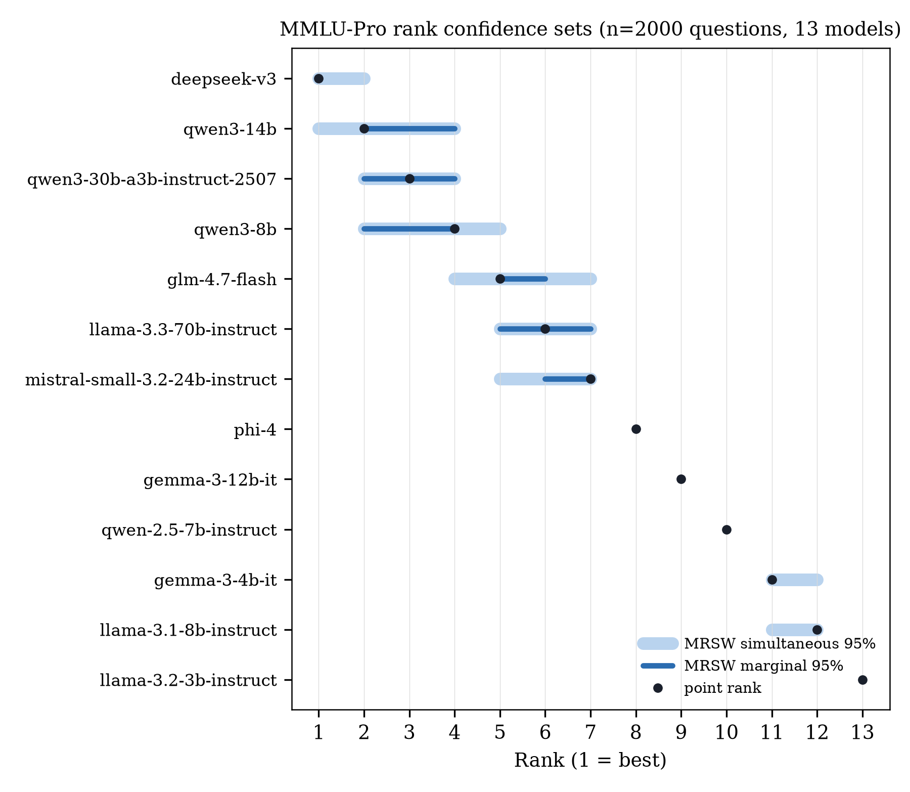

# LLM ranking with statistically valid rank confidence sets

Rank a set of LLMs on a benchmark and report **how uncertain each rank actually
is** — not just a point ranking. Built on AISI's
[Inspect](https://inspect.aisi.org.uk) for evaluation, with rank confidence sets
computed via the **Mogstad–Romano–Shaikh–Wilhelm (MRSW)** procedure.

The point of the project: a leaderboard that says "model A is rank 1, model B is
rank 2" hides the fact that, on a finite set of questions, that ordering is a
*sample estimate*. Two models a fraction of a percent apart are often
statistically indistinguishable. MRSW turns the per-question score matrix into a
**confidence set of plausible ranks** for each model, correctly accounting for
(a) the shared-item correlation (all models answer the *same* questions) and
(b) multiple comparisons across the roster.

## Results

13 models on **MMLU-Pro** (stratified sample, n = 2000 questions, 1 epoch), all
served through OpenRouter:



| Rank | Model | Accuracy % | 95% CI | Rank set (MRSW sim.) |
|---|---|---|---|---|
| 1 | deepseek-v3 | 78.8 | [77.0, 80.6] | {1–2} |
| 2 | qwen3-14b | 75.8 | [73.9, 77.7] | {1–4} |
| 3 | qwen3-30b-a3b | 74.8 | [72.8, 76.6] | {2–4} |
| 4 | qwen3-8b | 74.1 | [72.1, 76.0] | {2–5} |
| 5 | glm-4.7-flash | 70.9 | [68.9, 72.8] | {4–7} |
| 6 | llama-3.3-70b | 70.2 | [68.2, 72.2] | {5–7} |
| 7 | mistral-small-3.2-24b | 67.8 | [65.7, 69.8] | {5–7} |
| 8 | phi-4 | 63.2 | [61.1, 65.3] | {8} |
| 9 | gemma-3-12b | 58.5 | [56.3, 60.6] | {9} |
| 10 | qwen2.5-7b | 52.9 | [50.8, 55.1] | {10} |
| 11 | gemma-3-4b | 43.9 | [41.7, 46.1] | {11–12} |
| 12 | llama-3.1-8b | 40.1 | [38.0, 42.3] | {11–12} |
| 13 | llama-3.2-3b | 22.1 | [20.3, 24.0] | {13} |

The top four models occupy overlapping rank sets — the point ranking among them
is within sampling noise. The full breakdown (naive vs MRSW marginal vs MRSW
simultaneous) is in [`outputs/rank_confidence.md`](outputs/rank_confidence.md).

> Note: `openrouter/deepseek/deepseek-chat` resolves to **DeepSeek V3** on
> OpenRouter (labeled `deepseek-v3` above), which is a different endpoint from the
> DeepSeek official API's `deepseek-chat`.

## Quickstart

```bash
python3 -m venv .venv && source .venv/bin/activate
pip install -r requirements.txt
cp .env.example .env          # add your OPENROUTER_API_KEY

python run_ranking.py --limit 5     # smoke test (5 questions)
python run_ranking.py               # full run: MMLU-Pro, n=500, 1 epoch
python analyze.py                   # -> outputs/ranking.{md,csv} + rank_confidence.md
inspect view --log-dir outputs/logs # interactive Inspect UI
```

Every model in `models.yaml` runs off a single `OPENROUTER_API_KEY`. Re-running
`run_ranking.py` resumes and reuses completed samples (won't re-charge finished
work).

## Benchmarks

```bash
python run_ranking.py                       # MMLU-Pro (default), stratified n=500
python run_ranking.py --n 2000              # tighter rank sets (more cost)
python run_ranking.py --benchmark gpqa --epochs 4   # GPQA-Diamond, official protocol
```

MMLU-Pro is the default because its mid-tier spread *discriminates* between the
open models here; near-saturated benchmarks (GPQA-Diamond on frontier models)
leave everything clustered in the 90s. Both load from public sources — no
HuggingFace token needed.

## Layout

| File | Purpose |
|---|---|
| `models.yaml` | OpenRouter model roster (one key enables all) |
| `run_ranking.py` | runs `eval_set` over the selected benchmark (resumable) |
| `analyze.py` | logs → `outputs/ranking.{md,csv}` + `rank_confidence.md` |
| `mrsw.py` | MRSW rank confidence sets (naive / marginal / simultaneous) |
| `compare_methods.py`, `tau_sets.py` | extra analyses (multiplicity-vs-dependence decomposition, top/bottom-tier sets) |
| `test_mrsw.py` | property-based tests for the MRSW implementation |
| `outputs/` | committed ranking + figures (raw Inspect logs are gitignored) |

## Method

For an n×p score matrix `X` (n questions, p models, `X[i,j] ∈ [0,1]`):

1. Accuracy vector `θ̂ = X̄` and the covariance of the mean, `Σ̂ = Cov(X̄)`.
2. Pairwise difference SE `se_jk = √(Σ_jj + Σ_kk − 2·Σ_jk)` — the `−2·Σ_jk` term
   is the shared-item gain (same questions → positively correlated scores →
   tighter difference variance than the independence assumption).
3. A parametric bootstrap `Z ~ N(0, Σ̂)` gives critical values for the
   standardized pairwise statistic, in **marginal** (per-model) and
   **simultaneous** (family-wise) flavors.
4. Each model's rank set is `[ N⁻+1 , p−N⁺ ]`, where `N⁻`/`N⁺` count competitors
   significantly better / worse.

A **naive** baseline (independence + no multiple-comparison correction — the
common "do the marginal CIs overlap?" rule) is computed alongside, so the tables
isolate exactly what MRSW buys.

**Coverage caveat:** the rank sets quantify *item-sampling* uncertainty (the
benchmark as a sample from a question population). They do not capture generation
stochasticity or prompt sensitivity — report that when citing the numbers.

## Reference

Mogstad, M., Romano, J. P., Shaikh, A. M., & Wilhelm, D. (2024). *Inference for
ranks with applications to mobility across neighbourhoods and academic
achievement across countries.* Review of Economic Studies, 91(1), 476–518.

```bibtex
@article{mogstad2024inference,
  title={Inference for ranks with applications to mobility across neighbourhoods and academic achievement across countries},
  author={Mogstad, Magne and Romano, Joseph P and Shaikh, Azeem M and Wilhelm, Daniel},
  journal={Review of Economic Studies},
  volume={91},
  number={1},
  pages={476--518},
  year={2024},
  publisher={Oxford University Press US}
}
```

## License

MIT — see [LICENSE](LICENSE). © 2026 Z.Lin.
